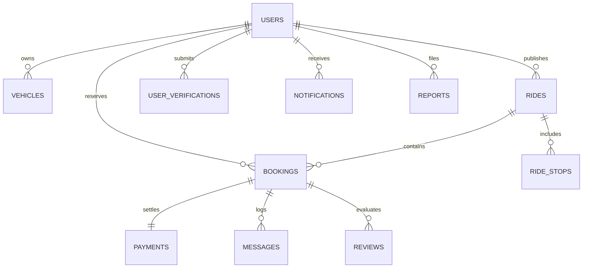

# CoRide Database Design & Data Integrity

CoRide utilizes a relational database architecture (PostgreSQL in production, SQLite for local standalone development) orchestrated through SQLAlchemy 2.0.

## Entity Relationship Architecture

---

## Core Tables

| Table | Primary Key | Key Fields | Description |
| :--- | :--- | :--- | :--- |
| `users` | `id` (UUID) | `name`, `email`, `phone`, `password_hash`, `rating_avg`, `trips_count`, `is_driver`, `is_admin`, `emergency_contact` | Unified user entity with dynamic role switching |
| `vehicles` | `id` (UUID) | `owner_id`, `make`, `model`, `year`, `registration_no`, `seats_total`, `ac`, `luggage_capacity`, `verified` | Vehicle specs and amenity configurations |
| `rides` | `id` (UUID) | `driver_id`, `vehicle_id`, `origin_text`, `destination_text`, `origin_lat/lng`, `departure_at`, `seats_total`, `seats_available`, `price_per_seat`, `status` | Published driver corridor schedules |
| `ride_stops` | `id` (UUID) | `ride_id`, `stop_order`, `place_name`, `lat`, `lng`, `planned_at`, `price_from_origin` | Intermediate waypoint boarding/dropping locations |
| `bookings` | `id` (UUID) | `booking_code`, `ride_id`, `rider_id`, `seats`, `pickup_stop_name`, `subtotal`, `service_fee`, `total`, `status` | Atomically reserved passenger seats |
| `payments` | `id` (UUID) | `booking_id`, `provider`, `provider_order_id`, `amount`, `status`, `refund_amount`, `webhook_verified` | Financial ledger and refund allocations |
| `messages` | `id` (UUID) | `booking_id`, `sender_id`, `body`, `is_system`, `created_at` | Realtime in-ride chat records |
| `reviews` | `id` (UUID) | `booking_id`, `reviewer_id`, `reviewee_id`, `rating`, `punctuality_rating`, `driving_rating`, `cleanliness_rating` | Mutual post-trip feedback |
| `user_verifications` | `id` (UUID) | `user_id`, `type`, `document_number`, `document_url`, `status`, `reviewed_by` | Identity & Driver License audit queue |
| `reports` | `id` (UUID) | `reporter_id`, `target_user_id`, `ride_id`, `category`, `details`, `status`, `admin_notes` | Safety and dispute ticket records |
| `notifications` | `id` (UUID) | `user_id`, `type`, `title`, `body`, `read_at` | In-app user notifications |

---

## Concurrency & Data Constraints

1. **Atomic Seat Locking**:
   - Seat reservation transactions query the target ride with row locks (`with_for_update` in PostgreSQL) to strictly prevent concurrent over-booking.
   - Database checks ensure `seats_available >= 0` at all times.
2. **Deterministic Refund Isolation**:
   - Cancelling a ride or seat booking restores the available seat inventory immediately within the same transaction and logs refund amounts idempotently.
